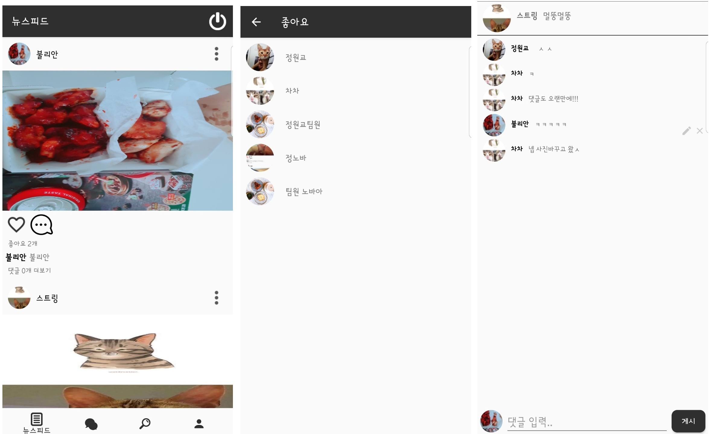

# Baking-Cat
Java 사용 Android SNS Application

## 주요기능

- 회원관리
  - 회원가입
  - 로그인
  - 자동 로그인
  
  
- 친구관리
  - 팔로우요청 수락, 거절
  - 팔로우 취소 
 

- 뉴스피드
  - 팔로잉 한 친구의 게시물만 뉴스피드에 출력
  - 좋아요 , 좋아요 취소
  - 좋아요 누른 친구 리스트 --> 클릭 시 개인 프로필로 이동
  - 댓글 입력 , 수정 , 삭제
  - 게시물 옵션
    - 본인 게시물 --> 게시물 수정 , 삭제
    - 친구 게시물 --> 팔로우 취소
  - 게시물 클릭 시 이미지 확대 
  - 게시물 길게 클릭 시 이미지 다운로드

- 채팅
  - 1:1 채팅
  - 그룹 채팅
  - 메시지 , 사진 , 음성메시지
  - 읽지않은 사람 수 , 메시지 보낸시간 표시
  - 채팅방 목록 클릭 시 대화방에 참여한 계정 확인 --> 클릭 시 개인프로필로 이동
  - 대화방 이름 변경 가능
  
- 프로필 수정

- 개인 프로필에서 1:1대화 연결 가능

## 캡처 이미지

> ▲▲▲ 스플레쉬 , 로그인 , 회원가입

> ▲▲▲ 내 프로필 , 친구 프로필 , 프로필 수정

> ▲▲▲ 뉴스피드 , 좋아요 리스트 , 댓글

> ▲▲▲ 채팅목록 , 메시지 , 대화방 인원

> ▲▲▲ 팔로잉 , 팔로우요청 수락, 거절

## 데이터베이스 구조(RealTime FireBase)

> ▲▲▲ 최상위 데이터베이스

> ▲▲▲ 유저관리 데이터베이스

> ▲▲▲ 게시물 데이터베이스

> ▲▲▲ 채팅방 데이터베이스

